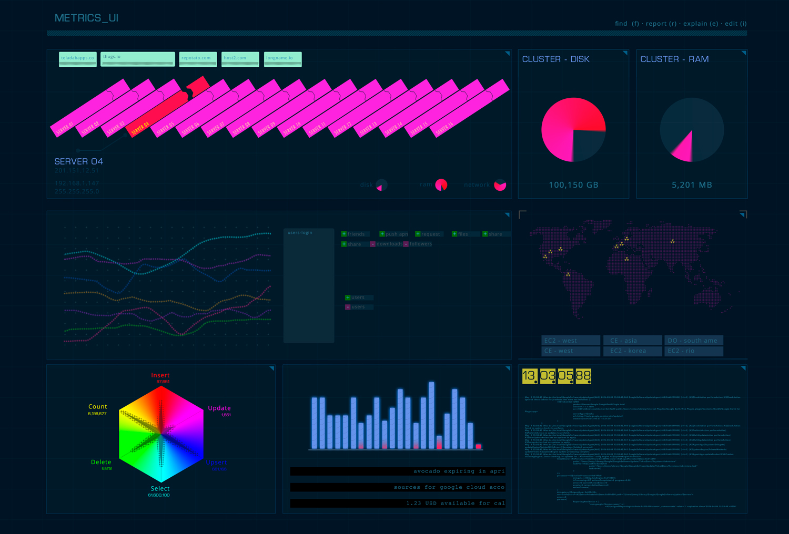

# starship
Futuristic UI metrics replace for promdash.

Goals:

* One screen to view them all.
* Every panel would have the most useful info.
* Easy deploy.
* Badass design not viewed until now.

Most metrics projects has simple charts without magic. I want a window that show
all I need to know and has a futuristic feel so every person around say
"Wow!".

This project will be done in my free time so don't wait for this until 2017
(I hope).
But you can colaborate to bring it soon. So for that reason I put the guidelines
and rules to make this happen.

Requirements:
* [Go](https://golang.org) for share logging.
* [Three.js](http://threejs.org) for web client.
* Npm for code generation on frontend KIS.
